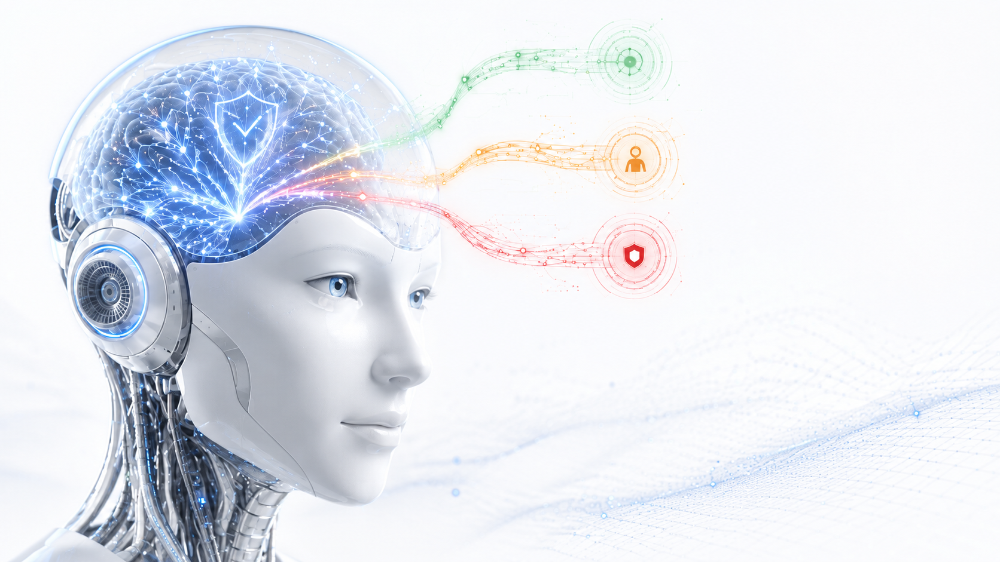

<p align="center">
  
</p>

# Origin — the reference check for AI agents

> **Model proposes. Environment verifies. Gate decides. Trace proves. — Capability is not permission.**

Before an AI agent gets production access, Origin tests it against **your** policies and permissions,
shows exactly where it is **over-granted**, and issues a signed **Origin Attestation** you can re-verify
independently — one that **automatically voids** when the agent's model, tools, context, or environment
change. Every verdict comes from a **deterministic oracle** (never an LLM grading an LLM), reproducibly,
and is checkable **offline in your browser**.

On the same architecture — *one evidence spine, many domain verifiers* — the same signed receipt covers a
**software agent**, a **factory/robot plan**, and a **spatial-reconstruction model**. The environment
(the verifier) is the moat, not the model.

- **Live showcase:** https://origin-physical-ai.pages.dev · **Check an agent:** [`/reference-check`](https://origin-physical-ai.pages.dev/reference-check) · **Verify an attestation:** [`/verify`](https://origin-physical-ai.pages.dev/verify)
- **Run the verifiers live:** [`/security`](https://origin-physical-ai.pages.dev/security) · **Labs (robot / fleet / spatial):** [`/labs`](https://origin-physical-ai.pages.dev/labs) · **Trust center:** [`/trust`](https://origin-physical-ai.pages.dev/trust)

---

## The one insight (this is the whole company)

A deterministic verifier that gates a proposed plan and emits **tamper-evident, signed, reproducible
evidence** is the **same product** whether the actor is a software agent touching an API, a humanoid
robot touching a factory floor, or a model reconstructing a room from a photo. **One evidence spine,
many domain verifiers** — demonstrated today with two actors (an agent action + a factory plan) that earn
the *same* receipt. The environment is the moat, not the model.

```
① INTENT     humans + agents express what they want            (a task, a site, a tool call)
② CONTROL    propose a plan, then GATE it — identity → scoped grant → fail-closed authorization
   PLANE      · measured intent (declared vs measured vs action)  · taint + blast-radius containment
③ EVIDENCE   tamper-evident: hash-chained trace + ScoreReceipts + ES256 Sigil signatures
   PLANE      · the deterministic oracle is the sole authority over labels, gates & hard-zeros
```

A **digital agent action** and a **physical factory plan** earn the *same* signed receipt — paste
either into [`/verify`](https://origin-physical-ai.pages.dev/verify.html) and it re-checks offline:
green means "reproducible under this verifier," tamper any field and it goes VOID.

## Wedge → moat → market

- **Wedge (land):** the self-serve **agent reference check** — a signed **Origin Attestation** +
  per-decision over-grant breakdown + the **drift-void** moment, visceral in 60 seconds.
- **Moat:** the **deterministic verified environment**. Digital = an IAM/agent gym; physical = a
  verifier-gated factory/robot environment. We know of no other verifier-gated environment that spans
  *both* actors on one evidence spine (see [`docs/PRIOR_ART.md`](docs/PRIOR_ART.md) for the adjacent
  work we build on) — and, on the narrow tasks we target, the environment beats the model.
- **Market:** config-bound **reference checks + attestations**, re-run on every config change (recurring),
  priced on **agents, tools, evaluation volume, and drift-monitoring — never on the Verified Readiness
  Level you earn** (the level is a deterministic result, not something you can buy). A catastrophic
  over-grant hard-caps the level: the right to act cannot be averaged back.

## The verified environment is a flywheel

The environment doesn't just gate — it **improves the actor, and can't lie to itself while doing it**,
because the reward authority is a deterministic oracle the system cannot edit:

- **[Cobra](services/cobra)** is an autoresearch loop that **hardens the verifier** against
  reward-hacking (red-team → seal → measure on held-out ground truth).
- The same discipline drives **verifier-gated recursive self-improvement**: a policy proposes, the
  oracle gates and labels verified traces, a better policy is distilled, and it **only promotes on a
  verifier-scored win** — so it **cannot regress on the verifier's metric**, and a fake win would have
  to break the verifier itself, which is exactly the surface Cobra/Chronos red-team and harden. Bounded,
  auditable self-improvement. *(The physical factory algorithm that instantiates this is private; only
  its evidence format is public.)*

## Why now

Every enterprise is about to deploy agents (and soon humanoids) that touch money, data, production,
and physical safety. The blocker isn't capability — it's **trust, governance, and liability**, and
there's no standard "the actor earned the right to do X, here's the signed receipt." Origin is that
standard. Per-step verification is what makes it real: verifying *every* action (not sampling around
it) is where reward-hacking and prompt-injection get caught — and at frontier inference speed
(e.g. `gemma-4-31b` on Cerebras, ~1,300 tok/s) that per-step tax is affordable, so the safety check
rides on every step. **The speed is the architecture.**

## Honest by design (the lines we don't cross)

- **The deterministic oracle is the only judge** of labels, gates, and hard-gated zeros — never an LLM
  grading an LLM. (An *optional* post-gate reward shaper exists in the env module; it can only reduce a
  reward within the oracle's verdict, never lift a gated 0, and ships off by default — with no judge the
  reward is byte-identical to the deterministic core.) We *contain* prompt
  injection; we don't claim to *prevent* it — the destructive action just never executes at the gate.
- Results are **"reproducible under this verifier,"** never "safe" or "correct." Synthetic data is
  labeled synthetic; unmeasured numbers say **projected**. This is machine-enforced — see the
  `honesty-lint` gate below.
- **Prototype in private pilot** — decision-support + evidence infrastructure, not production SaaS and
  not compliance certification. Real-customer readiness stays **blocked by default** until authorized.

---

## What's inside

| Part | Path | What it is |
|---|---|---|
| **Origin Web** | [`apps/origin-web`](apps/origin-web) | The live site + the evidence console, `/security` (run the verifiers in-browser), and public **[`/verify`](apps/origin-web/verify.html)**. |
| **Janus** (formerly Passport) | [`apps/janus`](apps/janus) | The gate: identity → scoped grant → fail-closed authorization, with measured-intent (Tell) + containment (Cordon). |
| **Chronos UI** | [`apps/chronos-ui`](apps/chronos-ui) | Front-end for the reward-hack discovery / verifier-hardening engine. |
| **Cobra / Chronos** | [`services/{cobra,chronos}`](services) | Auto-harden RL verifiers against reward hacking (red-team → patch → measure on held-out ground truth). |
| **Verifier SDK** | [`packages/verifier-core`](packages/verifier-core) + [`packages/evidence`](packages/evidence) | The shared evidence spine: canonical JSON, isomorphic SHA-256, hash-chained ScoreReceipts, ES256 **Origin Attestation** (Sigil) signatures, Merkle batches, config-bound **Crucible** credentials, the IAM + support gyms + the Verified Readiness Level ladder. Consumed by the apps *and* by external verifiers. |

## The cast — the pieces, and how they collaborate

The names aren't decoration: each guards one part of the threshold between *what an agent can do* and
*what it's permitted to do.*

| Name | Myth | What it is in Origin | How it collaborates |
|---|---|---|---|
| **Origin** | — (the substrate / the world) | The evidence spine — the one contract every actor is measured against. | Everything below plugs into it; a verdict from any verifier becomes the same signed, offline-checkable artifact. |
| **Janus** | **Roman** god of gates, doorways & thresholds — two-faced, watching what enters *and* what leaves | The runtime **gate + credential broker**: identity → scoped, revocable authority → fail-closed authorization, with measured intent (Tell) and blast-radius containment (Cordon). It brokers **handles, never raw secrets**. | Stands at the threshold when an agent proposes an action — routes every tool call through itself, and refuses the secret to a tainted agent. |
| **Crucible** | a vessel where metal is tested by fire | The **test environment**: an agent's policy is run through a deterministic least-privilege gym and forged into a **Verified Readiness Level** (L0–L4). | Consumes the policy Janus would enforce; hands its verdicts to the Oracle to be judged and sealed. |
| **the Oracle** | the **Greek** Oracle (Delphi) — the source of true judgment | The **deterministic verifier** — the *sole* authority over labels, gates, and hard-zeros. **Never an LLM grading an LLM.** | Judges every proposed action *finish / escalate / refuse*; its verdict is the only thing that can mint an attestation. |
| **Origin Attestation** *(Sigil)* | a sigil — a sealed mark of authority | The **ES256-signed receipt** that seals a verdict: the level, the config it's bound to, the evidence. | Voids the moment the agent's model/tools/context/environment drift; re-verifies offline at `/verify`. |
| **Chronos** | **Greek** Titan of **time** | The **reward-hack-discovery / verifier-hardening** engine (with the Chronos UI). | Over time, keeps hardening the Oracle so a policy can never learn to game the metric — the verifier gets *stronger* with every run. |
| **Cobra** | the serpent — the adversary that makes the guardian stronger | The **red-team**: auto-attacks the verifier (red-team → patch → measure on held-out ground truth). | Feeds Chronos the exploits; a verifier that survives Cobra is one you can trust. |
| **Foundry** | the forge | Where new **verified environments / gyms** are forged (the Labs). | Extends the one spine to new actors — a robot fleet, a spatial-reconstruction model — each with its own domain verifier. |

**The loop, in one breath:** an agent proposes → **Janus** gates it and brokers scoped authority →
**Crucible** puts the policy through the gym → **the Oracle** (deterministic, never an LLM) judges every
step → the verdict is sealed as an **Origin Attestation** anyone can re-verify offline → **Cobra +
Chronos** keep red-teaming and hardening the Oracle so it can't be gamed → **Foundry** forges the next
verified environment. *Capability is never mistaken for permission.*

## Quickstart

```bash
make install        # npm workspaces (TS) + uv sync per Python service
make gates-all      # ONE green scoreboard: TS build + all TS/Python suites + evidence-verify + honesty
make dev-web        # run the live site locally
make help           # all targets
```

`make gates-all` runs everything — the two TS apps, the evidence + verifier-core suites, the
`services/{cobra,chronos}` Python suites (the deterministic-oracle moat), the evidence-verify scripts,
and the `honesty-lint` overclaim tripwire — with real exit codes and a per-suite scoreboard. CI
([`.github/workflows/ci.yml`](.github/workflows/ci.yml)) gates the same surface on every push, plus a
secret scan and dependency audit.

## Where to look

- **The oracle (the only judge):** [`apps/origin-web/src/warehouse.ts`](apps/origin-web/src/warehouse.ts) → `verifyWarehouseRollout` + `bfsOracle`; property-tested in `warehouse.properties.test.ts` and `services/cobra/tests/test_oracle_properties.py`.
- **The evidence spine:** [`packages/evidence/env-evidence.mjs`](packages/evidence/env-evidence.mjs) + [`packages/verifier-core`](packages/verifier-core) (Sigil, Merkle, Crucible, IAM gym).
- **Verify it yourself:** [`/verify`](https://origin-physical-ai.pages.dev/verify.html) — paste any Origin receipt, credential, trace, or Sigil; it re-verifies offline in your browser.

---

*Deploy note: pushing this repo does **not** deploy anything — the live site is a separate,
human-owned Cloudflare Pages cutover. Secrets live only in per-app `.env.local` (gitignored), never
committed.*
