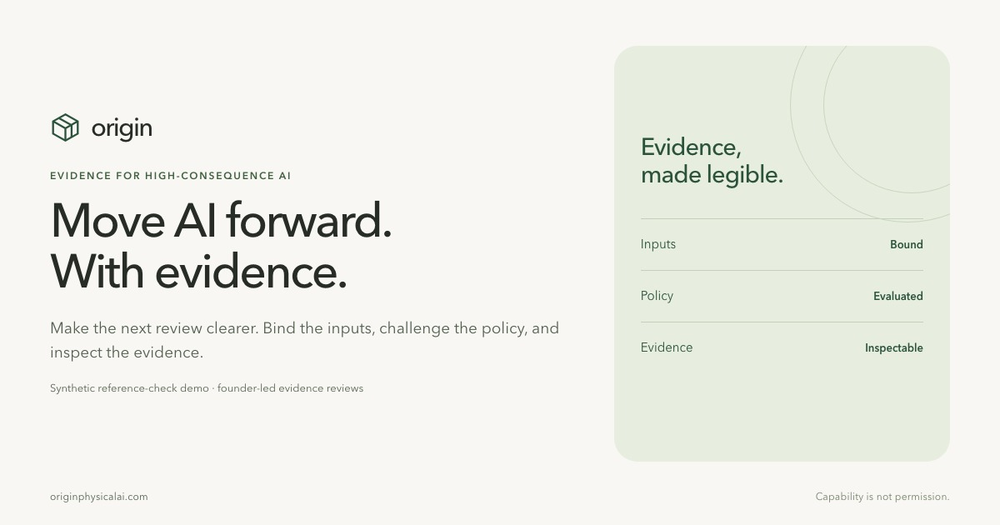

<p align="center">
  <a href="https://originphysicalai.com">
    
  </a>
</p>

# Origin — Move AI forward. With evidence.

**A public trust layer, evidence format, and working demos for AI evidence review.**

A capable agent and an authorized action are different things. Origin makes that boundary
inspectable through deterministic policy evaluations, configuration-bound artifacts, and
independent verification. Its Physical AI demos explore the same evidence questions in bounded
simulations.

> Model proposes. Environment executes. Verifier evaluates. Gate decides. Trace proves.
> **Capability is not permission.**

[**Explore the website**](https://originphysicalai.com) ·
[**Run a reference check**](https://originphysicalai.com/reference-check) ·
[**Verify an artifact**](https://originphysicalai.com/verify) ·
[**Public source**](https://github.com/bohueilin/Origin)

## Try the public workflow

| Start here | What you can inspect |
|---|---|
| [Agent Reference Check](https://originphysicalai.com/reference-check) | A selected policy evaluated against deterministic synthetic support and IAM tasks, with a configuration-bound demo artifact. |
| [Artifact verifier](https://originphysicalai.com/verify) | Offline integrity, tamper, and configuration-drift checks for supported artifact formats. |
| [Evidence traces](https://originphysicalai.com/proof) | Clearly separated authored specimens, a downloadable machine-emitted sandbox trace, and the external evidence that has not yet been earned. |
| [Verifier demos](https://originphysicalai.com/security) | Browser demonstrations of deterministic policy and permission checks. |
| [Physical AI labs](https://originphysicalai.com/labs) | Robot, warehouse, fleet, and spatial examples in bounded simulations. |
| [Trust center](https://originphysicalai.com/trust) | Claim boundaries, provenance, verification records, and data-handling limits. |

The public reference check runs browser-local policy logic; it does not contact or execute the
named agent. Its evidence is signed by an unpinned browser-session key, so it is **untrusted by
default**. An intact signature demonstrates an integrity check, not trusted Origin issuance or a
verified provider effect. The proposed runtime gate/proxy and hosted verification API are design
artifacts, not generally deployed public capabilities. See the
[reference check versus runtime comparison](https://originphysicalai.com/reference-check-vs-runtime).

Origin is a working prototype seeking design partners. No active customer pilot, production
readiness, reviewer acceptance, or certification is claimed.

## One evidence contract, explicit authority

The common architecture separates a proposal, permission, execution, verification, evidence, and
release authority. Each domain needs a verifier suited to its question; sharing an evidence format
does not make the domains equivalent.

- **Deterministic authority:** the oracle supplies labels, verdicts, and hard-gated zeros. An LLM
  never grades another LLM. Optional post-gate reward shaping cannot lift an oracle rejection and
  is off by default.
- **Inspectable evidence:** canonical JSON, hashes, trace chains, receipts, and signatures expose
  the bindings a reviewer can recheck. Integrity, signer trust, execution success, and permission
  to deploy remain separate checks.
- **Verifier hardening:** Cobra and Chronos explore reward-hack discovery, verifier patches, and
  held-out evaluation. A verifier result is bounded by the verifier and its inputs.
- **Release authority:** Origin issues evidence. The customer's gate and named risk owner retain
  the deployment decision.

## What is in this repository

| Component | Path | Public scope |
|---|---|---|
| Origin Web | [`apps/origin-web`](apps/origin-web) | Product website, reference check, artifact verifier, evidence console, and labeled demos. |
| Janus | [`apps/janus`](apps/janus) | Credential-broker and autonomy-trace prototypes for scoped authority and fail-closed authorization. |
| Chronos UI | [`apps/chronos-ui`](apps/chronos-ui) | Interface for verifier-hardening workflows. |
| Cobra / Chronos | [`services`](services) | Python research and test tooling for verifier hardening. |
| Verifier core | [`packages/verifier-core`](packages/verifier-core) | Deterministic gyms, configuration-bound credentials, signatures, and verification primitives. |
| Evidence | [`packages/evidence`](packages/evidence) | Evidence contracts, canonical serialization, hashes, and receipt machinery. |

Proprietary algorithm implementation and internal strategy are kept outside this public repository.
The public site includes a research snapshot whose private-pipeline metrics cannot be re-derived
from this repository alone.

## Evidence boundaries

- Synthetic demos, generated counterfactuals, authorized fixtures, and customer-owned proof are
  different evidence lanes. None substitutes for another.
- Simulation results mean reproducible under the named verifier, inputs, and environment. They
  do not establish real-world safety, robot certification, or production-autonomy validation.
- Learned-policy examples use route-summary and map-derived features, not raw end-to-end perception.
- Public Foundry uses a deterministic browser-local sample. Provider-backed processing requires
  a separately enabled local/backend workflow and affirmative consent.
- Generated brand imagery and footage are illustrations, not product recordings, company
  facilities, or customer evidence.

## Run locally

For the public web app, use Node 20+ and the root npm workspace install:

```bash
npm ci
npm run dev -w @origin/origin-web
```

Validate the app and published proof:

```bash
npm run test -w @origin/origin-web
npm run build -w @origin/origin-web
npm run proof:verify -w @origin/origin-web
node scripts/honesty-lint.mjs
```

[`Makefile`](Makefile) is the monorepo front door. `make help` lists targets; `make install`
includes the isolated Python service environments, and `make gates-all` runs the wider build,
TypeScript/Python, evidence, and honesty gates. Gate results are scoped to the checked revision;
a green test run is not deployment authority.

## Navigate and contribute

Read [`PROJECT_OVERVIEW.md`](PROJECT_OVERVIEW.md), [`REPO_STRUCTURE.md`](REPO_STRUCTURE.md), and
[`AGENTS.md`](AGENTS.md) for the component map and operating rules. Start with
[`apps/origin-web/README.md`](apps/origin-web/README.md) for the web app's implemented behavior.

The canonical website is [originphysicalai.com](https://originphysicalai.com); its public source
is [bohueilin/Origin](https://github.com/bohueilin/Origin). Pushing or opening a pull request does
not deploy the website. Production release is separately human-dispatched and gated; see
[`docs/DEPLOY.md`](docs/DEPLOY.md). Secrets stay in ignored per-app `.env.local` files and must
never be committed.
