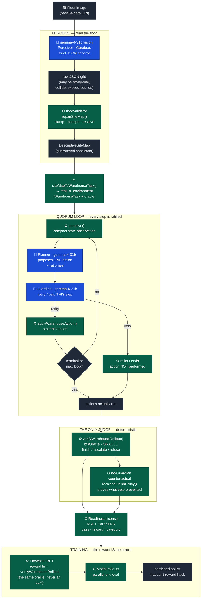

# Origin Foundry — Architecture

> Upload a floor plan. **gemma-4-31b (vision) on Cerebras** reads it into a real RL
> environment. A fast multi-agent loop — **Perceiver → Planner → Guardian/Verifier
> ratifies EVERY step** — runs at ~1,500 tok/s so we can train a robot policy that
> **can't reward-hack**, because the judge of "did it do the job safely" is a
> **deterministic oracle, never an LLM**.
>
> **Capability is not permission. The deterministic oracle is the only judge.**

"Origin Foundry" is the working name for the product; the engine is **Quorum** — no
agent acts alone, and every action is ratified before it is allowed to run.

---

## 1. Legend — what is an LLM vs. what is deterministic

This is the whole thesis, so read it first:

| Marker | Meaning |
| ------ | ------- |
| **🧠 LLM** | A call to **gemma-4-31b on Cerebras** (OpenAI-compatible Chat Completions, `https://api.cerebras.ai/v1`). Gemini is the optional GPU baseline; Gemma-on-Cerebras stays primary. |
| **⚙️ DET** | **Deterministic** code. No LLM, no network, no randomness that isn't seeded. The same input always yields the same output. **Every judge box is ⚙️ DET.** |

The LLM is allowed to be *capable* (propose any action, read any floor). It is **never**
allowed to be the *judge*. Each LLM box is wrapped by a ⚙️ DET box that repairs, gates,
or scores its output. That wrapper is the auditable "capability ≠ permission" gap.

---

## 2. Data flow — Mermaid



**Blue = 🧠 LLM (Cerebras gemma-4-31b).** Only three boxes are blue: the Perceiver
(vision), the Planner, and the Guardian. **Green = ⚙️ deterministic.** Every judge,
repair, env step, and the training reward are green. **No green box ever calls an LLM.**

---

## 3. Data flow — ASCII fallback

```
 ┌─────────────────────────────────────────────────────────────────────────────┐
 │  📷 FLOOR IMAGE  (base64 data URI — Cerebras takes base64 only, no hosted URL)│
 └───────────────────────────────────┬─────────────────────────────────────────┘
                                      │
   PERCEIVE ════════════════════════ ▼ ══════════════════════════════════════════
   ┌──────────────────────────────────────────────────────────────────────────┐
   │ 🧠 LLM  gemma-4-31b VISION (Perceiver)         Cerebras · strict JSON       │
   │         "see" the floor → raw occupancy grid                                │
   └───────────────────────────────────┬────────────────────────────────────────┘
                                        │  raw JSON  (VLMs see well, count badly:
                                        │            off-by-one, collisions, OOB)
                                        ▼
   ┌──────────────────────────────────────────────────────────────────────────┐
   │ ⚙️ DET  floorValidator.repairSiteMap()                                       │
   │         clamp in-bounds · dedupe · one role per cell · log every fix         │
   └───────────────────────────────────┬────────────────────────────────────────┘
                                        ▼
                          DescriptiveSiteMap (guaranteed consistent)
                                        │
   ┌────────────────────────────────────▼───────────────────────────────────────┐
   │ ⚙️ DET  siteMapToWarehouseTask()   → a REAL RL environment (WarehouseTask)   │
   └────────────────────────────────────┬───────────────────────────────────────┘
                                        │
   QUORUM LOOP ═══════════════════════ ▼ ══════════ (every step ratified) ════════
   ┌──────────────────────────────────────────────────────────────────────────┐
   │   ┌──────────────────────────────────────────────────────────────────┐    │
   │   │ ⚙️ DET  perceive(state) → compact observation                       │    │
   │   └───────────────────────────────┬──────────────────────────────────┘    │
   │                                   ▼                                        │
   │   ┌──────────────────────────────────────────────────────────────────┐    │
   │   │ 🧠 LLM  PLANNER  gemma-4-31b → proposes ONE action + rationale      │    │
   │   └───────────────────────────────┬──────────────────────────────────┘    │
   │                                   ▼                                        │
   │   ┌──────────────────────────────────────────────────────────────────┐    │
   │   │ 🧠 LLM  GUARDIAN gemma-4-31b → RATIFY or VETO *this* step           │    │
   │   └──────┬───────────────────────────────────────────────┬───────────┘    │
   │          │ ratify                                         │ veto           │
   │          ▼                                                ▼                │
   │   ⚙️ applyWarehouseAction()                       ⚙️ end rollout —          │
   │      state advances ──┐                              action NOT performed   │
   │                       │ loop until terminal / max loops                     │
   │                       └──────────────► (back to perceive)                   │
   └──────────────────────────────────────┬───────────────────────────────────┘
                                          │  actions ACTUALLY run
   THE ONLY JUDGE ════════════════════════▼═══════════════════════════════════════
   ┌──────────────────────────────────────────────────────────────────────────┐
   │ ⚙️ DET  verifyWarehouseRollout()  ·  bfsOracle  =  THE ORACLE                │
   │         labels finish / escalate / refuse · hard-gated reward · NEVER an LLM │
   │         ── plus ── no-Guardian counterfactual (recklessFinishPolicy):        │
   │            same intent WITHOUT the gate → proves what the veto prevented      │
   └───────────────────────────────────┬────────────────────────────────────────┘
                                        ▼
   ┌──────────────────────────────────────────────────────────────────────────┐
   │ ⚙️ DET  READINESS LICENSE   RSL + FAR / FRR (pass · reward · category)       │
   └───────────────────────────────────┬────────────────────────────────────────┘
                                        ▼
   TRAINING ═══════════════════════════════════════════════════════════════════
   ┌──────────────────────────────────────────────────────────────────────────┐
   │ ⚙️ DET  Fireworks RFT reward fn  =  verifyWarehouseRollout (the SAME oracle) │
   │ ⚙️ DET  Modal rollouts (parallel env eval)  →  hardened, un-hackable policy  │
   └──────────────────────────────────────────────────────────────────────────┘

   LEGEND:  🧠 LLM = gemma-4-31b on Cerebras (capable, proposes)
            ⚙️ DET = deterministic, no LLM (the judge, always)
```

---

## 4. Stage-by-stage — what runs, and where it lives

| Stage | Kind | What it does | Source |
| ----- | ---- | ------------ | ------ |
| Floor image → grid | 🧠 **LLM** | gemma-4-31b vision reads the floor into a raw JSON occupancy grid. Image is a **base64 data URI** (Cerebras accepts base64 only). Structured Output `json_schema` `strict:true`, `reasoning_effort: low`. | `server/cerebrasHandler.ts` · `server/foundryHandler.ts` (`handleParseFloor`) |
| Repair the grid | ⚙️ **DET** | `repairSiteMap()` clamps every cell in-bounds, dedupes, gives each cell one role (a wall can't sit on the start/item/drop), and **logs every fix** so the UI can show the repair. The model proposes; deterministic code disposes. | `src/foundry/floorValidator.ts` |
| Grid → environment | ⚙️ **DET** | `siteMapToWarehouseTask()` turns the clean `DescriptiveSiteMap` into a real `WarehouseTask` RL env (grid, start/item/drop, hazards, human-only, budgets). | `src/siteEval.ts`, `src/warehouse.ts` |
| Perceive | ⚙️ **DET** | `perceive()` renders the current env state into a compact text observation for the Planner. | `server/foundryHandler.ts` |
| Plan | 🧠 **LLM** | Planner (gemma-4-31b) proposes **one** `WarehouseAction` + rationale. `reasoning_effort: none` for the fast loop. Action space: `observe · scan · move:{n,e,s,w} · pick · drop · finish · escalate · refuse`. | `server/foundryHandler.ts` (`planNext`) |
| Verify (ratify/veto) | 🧠 **LLM** | Guardian (gemma-4-31b) ratifies or vetoes **every** proposed step. Because per-step verification is cheap at ~1,500 tok/s, we can afford a check on *each* action, not just at the end. **Fails safe**: if the verifier is unreachable, the deterministic safety check vetoes anything that leaves the grid, hits a wall, or enters a hazard/human-only cell. | `server/foundryHandler.ts` (`guard`) |
| Apply / end | ⚙️ **DET** | A ratified action advances state via `applyWarehouseAction()`; a veto **ends the rollout without performing the action**. | `src/warehouse.ts` |
| **Score (the only judge)** | ⚙️ **DET** | `verifyWarehouseRollout()` / `bfsOracle()` — the **ORACLE**. It labels the correct terminal (finish / escalate / refuse), hard-gates the reward (`outcome × shaped_bonus`), and flags `falseAccept` / `falseReject`. **Never an LLM.** | `src/warehouse.ts` |
| Counterfactual | ⚙️ **DET** | `recklessFinishPolicy()` replays the **same intent with no Guardian gate** and is scored by the same oracle — proving exactly what the per-step veto prevented. | `src/warehouse.ts` |
| Readiness license | ⚙️ **DET** | Emits the Readiness/Safety License: **RSL** plus **FAR** (false-accept rate over should-not-act tasks) and **FRR** (false-reject rate over finishable tasks). | `src/warehouse.ts` (`computeWarehouseMatrix`) |
| Train | ⚙️ **DET reward** | **Fireworks RFT** with the reward function **set to the oracle** (`verifyWarehouseRollout`) — the policy is optimized against the deterministic judge, so there is nothing to reward-hack. **Modal** runs the env rollouts in parallel. Training is **real but small** for the hackathon. | `services/factoryceo-trm/distill/{launch_fireworks_rft.py, fireworks_rft_evaluator.py, grpo.py}` · `services/factoryceo-trm/src/llm.py` |

**Why this can't be reward-hacked:** the policy is trained *and* graded by the same
deterministic oracle. There is no LLM judge to flatter, no rubric to game — the only
way to score is to actually finish the job safely (or correctly refuse/escalate).

---

## 5. Why Cerebras

The loop's hero property is that **per-step verification is effectively free**.

- gemma-4-31b on Cerebras runs at **~1,500 tok/s** (headline). **Measured live in this
  build: ~1,284 tok/s, TTFT ~8 ms**, with a correct Guardian veto. (We cite ~1,284 as
  the measured number and ~1,500 as the headline; any other figure on screen is labeled
  *illustrative*.)
- Real `tok/s` and `TTFT` come straight from the Cerebras API `time_info` object on
  every response — we show it on screen rather than estimating it.
- At GPU-class latency you ratify **once, at the end**. At ~1,500 tok/s you ratify
  **every step** — so an unsafe action is caught *before* it executes, not after the
  rollout. The speed isn't a vanity metric; it's what makes step-level verification a
  design option instead of a luxury. That is the difference between "the robot did
  something unsafe and we noticed" and "the robot was **not allowed** to."
- The Planner and Guardian both run `reasoning_effort: none` in the loop, which keeps
  each ratify/veto round-trip in the low-millisecond range.

A **Gemini GPU baseline** runs the same prompt side-by-side (allowed for this event) so
the speed delta is visible, but **gemma-4-31b on Cerebras is the primary** for all
Perceiver / Planner / Guardian calls.

---

## 6. Cerebras limits & the fresh-context-per-agent design

Official limits for this event (gemma-4-31b on Cerebras):

| Limit | Value |
| ----- | ----- |
| MSL — max sequence length | **65K** tokens |
| MCL — max context length | **32K** tokens |
| RPM — requests per minute | **100** |
| TPM — tokens per minute | **100K** |

**Design implication — fresh context per agent, per step.** We do **not** accumulate a
single growing transcript across the whole rollout. Each Planner and each Guardian call
is sent a **small, self-contained prompt** built fresh from the current env state
(`perceive()` + the task's walls/hazards/human-only lists). Benefits:

- **Stays far under MCL/MSL.** Every call is a few hundred tokens, not a transcript that
  grows with the rollout — so context length is never the bottleneck.
- **No cross-step contamination.** The Guardian judges *this* action against *this*
  state, with no room to be talked into ratifying by earlier chatter. Verification is
  per-step and stateless by construction.
- **Tight token budgets** (Planner ≤160, Guardian ≤120 completion tokens) keep us well
  inside **100K TPM**, and the loop's bounded step count (capped per task) keeps us
  inside **100 RPM** even though we make two LLM calls (plan + verify) per step.
- **The deterministic env carries state**, not the LLM context window. The
  `WarehouseState` is the memory; the LLMs are stateless functions over it.

This is the same principle as the rest of the system: keep the LLM small, fast, and
replaceable, and let the deterministic core hold the truth.

---

## 7. One-line invariant

> The LLM (gemma-4-31b on Cerebras) is the **eyes and hands**: it sees the floor and
> proposes actions, fast. The deterministic oracle is the **conscience**: it ratifies,
> scores, licenses, and trains. **Capability is not permission — and only the
> deterministic oracle is ever the judge.**

---

### Honesty notes

- Speed numbers are **real**: ~1,284 tok/s measured live, ~1,500 tok/s headline.
- Training is **real but small** for the hackathon window — the architecture (oracle as
  the RFT reward, Modal rollouts) is the contribution, not a large training run.
- Any figure not measured live (e.g. the GPU-baseline fallback numbers) is **labeled
  illustrative** in the UI.
- When `CEREBRAS_API_KEY` is absent, every route falls back to a clearly labeled
  deterministic mock (`source: 'mock'`) on the **same code path**, so the product demos
  offline and lights up the moment the key is set.
